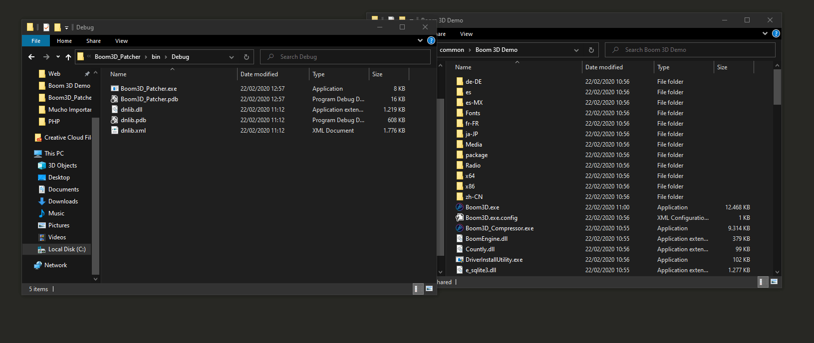

# Boom3D_Patcher
[](https://travis-ci.com/Mrakovic-ORG/Boom3D_Patcher)

An simple patcher for [Boom3D](https://store.steampowered.com/app/1071100/Boom_3D/)

## Features
- Detects if file has Compressor from ConfuserEx
- Automatically patch file

## Build
```SH
git clone https://github.com/Mrakovic-ORG/Boom3D_Patcher --recurse
cd Boom3D_Patcher\Boom3D_Patcher
dotnet build
```

## In action


## Disclaimer
This project has been made for educational purpose, Cracking/Deobfuscating/Un-protecting a licensed software is illegal, This project does not deobfuscate/un-protect the software.

## Credits
[0xd4d](https://github.com/0xd4d) for the awesome work he brings to .NET developers.

License
----

MIT